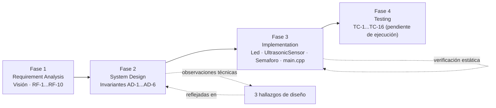
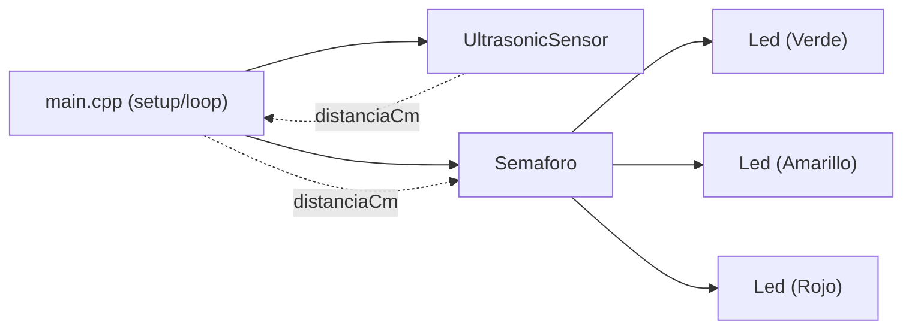
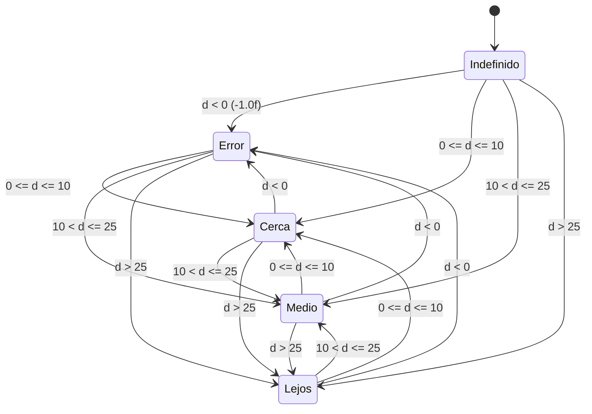
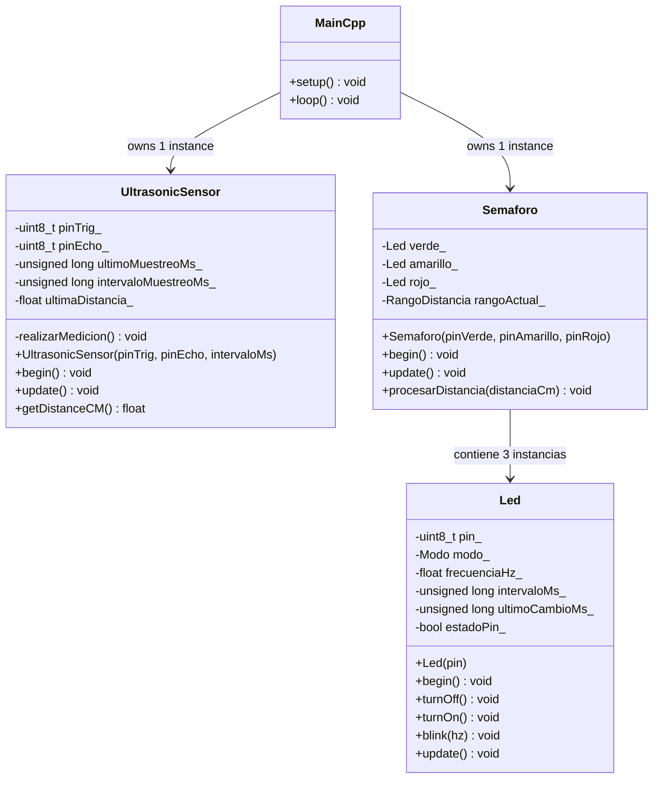

# Sistema de Control de Proximidad por Ultrasonido — Informe Consolidado de Desarrollo

## Resumen Ejecutivo

Este informe consolida el desarrollo del **Sistema de Control de Proximidad por Ultrasonido**, un proyecto ESP32 que mide distancia mediante un sensor ultrasónico **HC‑SR04** y traduce esa distancia en una señal visual tipo "semáforo" usando tres LEDs (rojo / amarillo / verde). A diferencia de una implementación de dos clases, este proyecto separa explícitamente **tres** responsabilidades en clases independientes — `Led`, `UltrasonicSensor` y `Semaforo` — orquestadas por un `main.cpp` delgado.

El desarrollo se reconstruye en cuatro fases, siguiendo la metodología BMAD:

| Fase | Contenido principal | Resultado |
| --- | --- | --- |
| 1. Requirement Analysis | Visión, usuario objetivo, glosario, requisitos funcionales, no-objetivos | 10 requisitos funcionales (RF‑1…RF‑10) y 3 preguntas abiertas resueltas en Fase 2 |
| 2. System Design | Paradigma de diseño, diagrama de dependencias, máquina de estados, invariantes | 6 invariantes arquitectónicos (AD‑1…AD‑6), mapa de pines, y 3 observaciones técnicas de diseño |
| 3. Implementation | Estructura de clases, inventario de código, detalles clave | 3 clases + `main.cpp` implementados (265+ líneas equivalentes) |
| 4. Testing | Plan de pruebas manual de 16 casos | Plan definido; ejecución sobre hardware físico **pendiente de registrar** |

**Estado al momento de escribir este informe:** los 10 requisitos funcionales están implementados en el código fuente (`codigo.md`) y ya se encuentran subidos al repositorio (`main`); el plan de pruebas manuales está completamente definido pero **no se ha ejecutado sobre hardware real** — no hay registro de resultados, fotografías, ni mediciones de frecuencia.

---

## Flujo de Desarrollo



---

## Fase 1 — Requirement Analysis

**Fuente:** código fuente del proyecto (`codigo.md`) y análisis del equipo.

### 1.1 Visión

Un prototipo embebido de control de proximidad que transforma lecturas ultrasónicas continuas en señales visuales intuitivas estilo semáforo: **rojo** = alerta de proximidad cercana (`d ≤ 10 cm`), **amarillo** = precaución intermedia (`10 < d ≤ 25 cm`), **verde** = libre/lejano (`d > 25 cm`), y **parpadeo simultáneo de los 3 LEDs** = lectura inválida o error. El sistema demuestra una arquitectura orientada a objetos, modular, sobre un microcontrolador ESP32.

### 1.2 Usuario Objetivo / Necesidades

Proyecto técnico-educativo de sistemas embebidos (operador único: quien construye el sistema también lo observa):

- Mostrar un sistema embebido autónomo con sensor ultrasónico HC‑SR04 y semáforo de LEDs.
- Confirmar de forma inmediata la zona de distancia sin depender de una consola serial.
- Aplicar diseño orientado a objetos y control no bloqueante mediante `millis()`.
- Ejecutar un procedimiento repetible de pruebas manuales de hardware tras cada cambio de código.

### 1.3 Glosario

| Término | Significado |
| --- | --- |
| **Lectura de distancia** | Valor en centímetros medido por `UltrasonicSensor`. |
| **Lectura inválida / Error** | Valor representado por `-1.0f`, causado por timeout de echo o por estar fuera del rango válido (2–400 cm). |
| **Cerca** | Rango `d ≤ 10 cm`; activa el LED rojo parpadeando a 4 Hz. |
| **Medio** | Rango `10 < d ≤ 25 cm`; activa el LED amarillo en encendido sólido. |
| **Lejos** | Rango `d > 25 cm`; activa el LED verde en encendido sólido. |
| **Error State** | Estado en que los tres LEDs parpadean simultáneamente a 5 Hz por una lectura inválida. |
| **Led** | Clase que controla un pin, modo (apagado/sólido/parpadeo) y temporización no bloqueante. |
| **UltrasonicSensor** | Clase que genera el pulso Trigger, lee el Echo y valida el rango. |
| **Semaforo** | Clase orquestadora que clasifica la distancia y gestiona los tres LEDs. |

### 1.4 Requisitos Funcionales

| ID | Requisito | Consecuencia comprobable |
| --- | --- | --- |
| **RF‑1** | Medición continua de distancia | Muestreo cada 100 ms; timeouts o valores fuera de `[2, 400]` cm retornan `-1.0f`. |
| **RF‑2** | Alerta de zona roja (`d ≤ 10 cm`) | Rojo parpadea a 4 Hz (~50% duty); amarillo y verde apagados. |
| **RF‑3** | Indicador de zona amarilla (`10 < d ≤ 25 cm`) | Amarillo sólido; rojo y verde apagados. |
| **RF‑4** | Indicador de zona verde (`d > 25 cm`) | Verde sólido; rojo y amarillo apagados. |
| **RF‑5** | Estado de lectura inválida / error | Los 3 LEDs parpadean juntos a 5 Hz hasta obtener una lectura válida. |
| **RF‑6** | Clase `Led` | Instancias independientes, cada una gestiona su pin y temporización sin bloquear a las demás. |
| **RF‑7** | Clase `UltrasonicSensor` | Única dueña de los pines Trigger/Echo; ningún otro módulo los manipula. |
| **RF‑8** | Clase `Semaforo` | Coordina las 3 instancias de `Led`, determina el rango y aplica la transición visual. |
| **RF‑9** | Optimización de cambio de estado | Evita reconfigurar los LEDs si la distancia se mantiene en el mismo rango. |
| **RF‑10** | Temporización no bloqueante | El muestreo y el parpadeo se controlan mediante `millis()`, no `delay()`. |

### 1.5 No-Objetivos (Explícitos)

No conectividad Wi‑Fi/Bluetooth/BLE · no interfaz web o app móvil · no telemetría en la nube · no almacenamiento persistente en EEPROM/Flash · no soporte multisensor · no calibración en tiempo de ejecución ni umbrales dinámicos · no optimización de bajo consumo.

### 1.6 Métricas de Éxito

Todos los casos de prueba manuales pasan en hardware ESP32 real, **y** las responsabilidades de `Led`, `UltrasonicSensor` y `Semaforo` están claramente desacopladas, sin lógica de negocio dispersa en `main.cpp`.

### 1.7 Preguntas Abiertas de Esta Fase

| # | Pregunta | Resuelta en |
| --- | --- | --- |
| 1 | Asignación exacta de pines GPIO en ESP32 | Fase 2 — Tabla de Asignación de Pines |
| 2 | Definición exacta de umbrales de distancia | Fase 2 — Máquina de Estados (10 cm / 25 cm) |
| 3 | Frecuencias de parpadeo para Alerta y Error | Fase 2 — 4 Hz (Cerca) y 5 Hz (Error) |

---

## Fase 2 — System Design (Arquitectura)

**Fuente:** estructura de clases del código fuente (`codigo.md`).

### 2.1 Paradigma de Diseño

> Programación Orientada a Objetos en C++, integrada con una máquina de estados finita y un super-loop no bloqueante basado en `millis()`.

El diseño distribuye responsabilidades en tres clases:

- `Led`: controlador de bajo nivel de un LED individual (modos Apagado, Sólido, Parpadeo).
- `UltrasonicSensor`: controlador del HC‑SR04, con cadencia de muestreo de 100 ms y filtrado de rango.
- `Semaforo`: orquestador de la máquina de estados visual — evalúa la distancia y aplica el patrón de LEDs correspondiente.

`main.cpp` actúa solo como punto de entrada: inicializa los componentes y los ejecuta dentro de `loop()`.

**Nota técnica:** la lectura ultrasónica en sí contiene micro-esperas directas (`delayMicroseconds(2/10)` y `pulseIn()` con timeout de 25 000 µs), mientras que la cadencia global de muestreo y el parpadeo de los LEDs se gestionan de forma no bloqueante mediante `millis()`. Es decir, el sistema es "no bloqueante" a nivel de orquestación general, no en la microsecuencia interna de disparo del sensor.

### 2.2 Diagrama de Dependencias de Componentes



`main.cpp` crea una instancia de `UltrasonicSensor` y una de `Semaforo`. `Semaforo`, a su vez, contiene tres instancias de `Led` (una por color).

### 2.3 Máquina de Estados de Distancia



`Semaforo` define los estados `Indefinido`, `Error`, `Cerca`, `Medio` y `Lejos`. El estado solo se actualiza cuando el nuevo rango calculado difiere del rango almacenado (`rangoActual_`).

### 2.4 Invariantes Arquitectónicos

| ID | Regla | Previene |
| --- | --- | --- |
| **AD‑1** | La cadencia de muestreo (~100 ms) se gestiona internamente en `UltrasonicSensor::update()` mediante `millis()`. | Lecturas excesivas o bloqueo del ciclo principal. |
| **AD‑2** | Solo distancias en `[2.0, 400.0]` cm son válidas; fuera de rango o timeout retorna `-1.0f`. | Inconsistencias en el tratamiento de lecturas erróneas. |
| **AD‑3** | `UltrasonicSensor` es el único dueño de los pines Trigger y Echo. | Conflictos de acceso al hardware del sensor. |
| **AD‑4** | `Led` gestiona su propio estado y temporización; `blink(hz)` es idempotente. | Reinicios constantes del temporizador que congelen el parpadeo. |
| **AD‑5** | `Semaforo` encapsula la clasificación de rangos y la coordinación de los 3 LEDs. | Dispersión de lógica de negocio en `main.cpp`. |
| **AD‑6** | La temporización del parpadeo vive dentro de `Led::update()` usando `millis()`. | Necesidad de un temporizador global o bloqueante. |

### 2.5 Asignación de Pines

| Señal | GPIO | Dirección | Función / Notas de Hardware |
| --- | --- | --- | --- |
| HC‑SR04 Trigger | 27 | Salida | Pulso de disparo de 10 µs |
| HC‑SR04 Echo | 26 | Entrada | Lectura de pulso mediante `pulseIn()` |
| LED Verde | 13 | Salida | Indicador de distancia lejana (`d > 25 cm`) |
| LED Amarillo | 12 | Salida | Indicador de distancia media (`10 < d ≤ 25 cm`) |
| LED Rojo | 14 | Salida | Indicador de distancia cercana (`d ≤ 10 cm`) |

Definidas en el espacio de nombres `Pines` de `main.cpp`.

### 2.6 Estructura del Proyecto

```text
Sistema-Control-Proximidad-ESP32/
├── Led.h / Led.cpp               # Controlador de LED (modos, blink no bloqueante, update)
├── UltrasonicSensor.h / .cpp     # Controlador HC-SR04 (muestreo 100 ms, pulseIn, validación)
├── Semaforo.h / Semaforo.cpp     # Orquestador del semáforo (máquina de estados, rangos)
└── main.cpp                      # Punto de entrada (configuración de pines, setup/loop)
```

### 2.7 Mapa Capacidad → Arquitectura

| RF | Vive en | Gobernado por |
| --- | --- | --- |
| RF‑1 | `UltrasonicSensor::update()` / `realizarMedicion()` | AD‑1, AD‑2, AD‑3 |
| RF‑2 | `Semaforo::procesarDistancia()` → `rojo_.blink(4.0f)` | AD‑4, AD‑5 |
| RF‑3 | `Semaforo::procesarDistancia()` → `amarillo_.turnOn()` | AD‑4, AD‑5 |
| RF‑4 | `Semaforo::procesarDistancia()` → `verde_.turnOn()` | AD‑4, AD‑5 |
| RF‑5 | `Semaforo::procesarDistancia()` → los 3 `.blink(5.0f)` | AD‑2, AD‑4, AD‑5 |
| RF‑6 | `Led.h` / `Led.cpp` | AD‑4, AD‑6 |
| RF‑7 | `UltrasonicSensor.h` / `.cpp` | AD‑1, AD‑2, AD‑3 |
| RF‑8 | `Semaforo.h` / `.cpp` | AD‑5 |
| RF‑9 | `Semaforo::procesarDistancia()` (filtro de rango idéntico) | AD‑5 |
| RF‑10 | `UltrasonicSensor` + `Led` (`millis()`) | AD‑1, AD‑6 |

### 2.8 Hallazgos de Revisión de Diseño

No se generó un documento independiente de revisión adversarial (esa práctica requiere un agente que produzca artefactos de revisión formales, que este equipo no utilizó). En su lugar, se documentan aquí las observaciones técnicas identificadas al analizar la implementación:

| # | Severidad | Hallazgo | Resolución / Verificación |
| --- | --- | --- | --- |
| 1 | Media | Precisión sobre "no bloqueante": la medición contiene micro-esperas controladas. | La cadencia global y el parpadeo usan `millis()`; `realizarMedicion()` usa `delayMicroseconds()` y `pulseIn()` con timeout de 25 000 µs. |
| 2 | Media | Verificación de frecuencias de parpadeo. | Zona Cerca usa 4 Hz (intervalo = 125 ms); Error State usa 5 Hz (intervalo = 100 ms). |
| 3 | Baja | Optimización de cambio de estado. | Confirmada la guarda `if (nuevoRango == rangoActual_) return;` en `Semaforo.cpp`. |
| 4 | Documental | Ausencia de una revisión de diseño formal/adversarial independiente registrada. | Queda como limitación conocida de este informe (ver §4.4). |

---

## Fase 3 — Implementation

**Fuente:** `Led.h/.cpp`, `UltrasonicSensor.h/.cpp`, `Semaforo.h/.cpp`, `main.cpp` (`codigo.md`).

### 3.1 Estructura de Clases (tal como fue construida)



### 3.2 Inventario de Código Fuente

| Archivo | Responsabilidad |
| --- | --- |
| `Led.h` | Declaración de la clase `Led` y enumeración de modos (`Apagado`, `Solido`, `Parpadeo`). |
| `Led.cpp` | Control de GPIO: encendido, apagado, parpadeo idempotente. |
| `UltrasonicSensor.h` | Declaración de `UltrasonicSensor` e interfaz de medición. |
| `UltrasonicSensor.cpp` | Disparo Trigger, lectura de Echo, conversión a cm, filtro `[2, 400]`, cadencia de 100 ms. |
| `Semaforo.h` | Declaración de `Semaforo` y enumeración de rangos (`Indefinido`, `Error`, `Cerca`, `Medio`, `Lejos`). |
| `Semaforo.cpp` | Clasificación de distancia, transiciones de estado, control de las 3 instancias de `Led`. |
| `main.cpp` | Espacio de nombres `Pines`, instanciación de objetos globales, `setup()`, `loop()`, impresión periódica por Serial. |

### 3.3 Detalles Clave de Implementación

- **Clasificación de rangos** (`Semaforo::procesarDistancia`):
  - `distanciaCm < 0.0f` → `Error` (3 LEDs parpadeando a 5 Hz)
  - `distanciaCm ≤ 10.0f` → `Cerca` (rojo parpadea a 4 Hz)
  - `distanciaCm ≤ 25.0f` → `Medio` (amarillo sólido)
  - `distanciaCm > 25.0f` → `Lejos` (verde sólido)
- **Cálculo de parpadeo** (`Led::blink`): `intervaloMs = 1000 / (frecuenciaHz × 2)` (medio período).
- **Idempotencia del parpadeo** (`Led::blink`): solo reinicia el temporizador si cambia el modo o la frecuencia solicitada — evita que llamadas repetidas de `blink()` en cada `loop()` congelen el LED en sólido.
- **Validación del sensor** (`UltrasonicSensor::realizarMedicion`): distancia = `duracionUs × 0.0343 / 2`; si `pulseIn()` retorna `0` (timeout a 25 000 µs) o la distancia cae fuera de `[2.0, 400.0]` cm, se asigna `-1.0f`.
- **Optimización de cambio de estado** (`Semaforo::procesarDistancia`): `if (nuevoRango == rangoActual_) return;` evita reconfigurar los LEDs en cada iteración mientras el objeto permanece en la misma zona.
- **Salida por Serial** (`main.cpp`): imprime la distancia (o una alerta de lectura inválida) cada 250 ms a 115200 baudios, sin bloquear el `loop()`.

### 3.4 Historial de Commits

El código fue desarrollado, probado localmente y subido al repositorio (`main`) como un único commit inicial que integra las cuatro unidades (`Led`, `UltrasonicSensor`, `Semaforo`, `main.cpp`). El desglose por clase y fase presentado en este informe (§3.1–§3.3) se documenta aquí de forma retrospectiva, a partir del código final.

---

## Fase 4 — Testing

**Fuente:** casos de prueba definidos por el equipo a partir del comportamiento implementado.

### 4.1 Estrategia de Pruebas

Verificación mediante **plan de pruebas manual sobre hardware físico** (ESP32 + HC‑SR04 + 3 LEDs con resistencias limitadoras), con una cinta métrica y un cronómetro. No hay suite de pruebas automatizadas (fuera de alcance para un demo de esta escala).

### 4.2 Casos de Prueba Manuales

| TC | Escenario | Resultado Esperado | Cubre |
| --- | --- | --- | --- |
| TC‑1 | Objeto a 5 cm (`d ≤ 10`) | Rojo parpadea a 4 Hz; amarillo/verde apagados | RF‑2 |
| TC‑2 | Objeto exactamente a 10 cm | Rojo parpadea a 4 Hz | RF‑2 |
| TC‑3 | Objeto a 15 cm (`10 < d ≤ 25`) | Amarillo sólido; rojo/verde apagados | RF‑3 |
| TC‑4 | Objeto exactamente a 25 cm | Amarillo sólido | RF‑3 |
| TC‑5 | Objeto a 30 cm (`d > 25`) | Verde sólido; rojo/amarillo apagados | RF‑4 |
| TC‑6 | Objeto a 100 cm | Verde sólido | RF‑4 |
| TC‑7 | Sin eco válido / sensor desconectado | Los 3 LEDs parpadean juntos a 5 Hz | RF‑5 |
| TC‑8 | Recorrido 5 → 15 → 30 → 5 cm | Rojo → Amarillo → Verde → Rojo, sin solapamientos | RF‑2/3/4 |
| TC‑9 | Objeto estático a 30 cm | Verde encendido continuo, sin reinicios de temporizador | RF‑9 |
| TC‑10 | Parpadeo rojo durante 5 s | ~20 ciclos completos (4 Hz) | RF‑2, RF‑6 |
| TC‑11 | Parpadeo de error durante 5 s | ~25 ciclos completos (5 Hz) | RF‑5, RF‑6 |
| TC‑12 | Recuperación de Error → 15 cm | Sale del error, amarillo sólido en ~1 ciclo | RF‑5, RF‑1 |
| TC‑13 | Objeto a &lt;2 cm (límite inferior) | Estado de Error (`-1.0f`) | RF‑1, RF‑5 |
| TC‑14 | Objeto exactamente a 2 cm | Lectura válida | RF‑1 |
| TC‑15 | Objeto exactamente a 400 cm | Lectura válida | RF‑1 |
| TC‑16 | Objeto a &gt;400 cm / timeout | Estado de Error (`-1.0f`) | RF‑1, RF‑5 |

**Estado de ejecución:** el plan está completamente definido, pero **no existe registro de ejecución sobre hardware físico** — no hay resultados Pass/Fail, fotografías, ni mediciones de frecuencia documentadas. Ejecutar TC‑1 a TC‑16 sobre la placa flasheada es la siguiente acción pendiente del proyecto.

### 4.3 Verificación Estática de Código

- La estructura modular (`Led`, `UltrasonicSensor`, `Semaforo`, `main.cpp`) cumple la separación de responsabilidades definida en la Fase 2.
- Se verificó que no existen llamadas a `delay()` dentro de la lógica de orquestación (`Semaforo`, `main.cpp`) ni dentro de `Led`; las únicas esperas bloqueantes de corta duración están acotadas a `UltrasonicSensor::realizarMedicion()` (ver hallazgo #1, §2.8).

### 4.4 Brechas Conocidas y Backlog

| Brecha / Oportunidad | Estado |
| --- | --- |
| No hay registro documentado de resultados de pruebas físicas sobre placa real | Pendiente |
| El historial Git es un único commit (sin desglose por clase/fase) y no hay una revisión de diseño independiente registrada | Pendiente / mejora de proceso |
| No hay pruebas unitarias automatizadas para `Semaforo::procesarDistancia()`, `Led` ni `UltrasonicSensor` | Backlog futuro (fuera de alcance del MVP) |
| No hay diagrama de cableado incluido en el proyecto | Pendiente |
| Los umbrales (10 cm, 25 cm) están fijos en `Semaforo.cpp`, no son configurables | Mejora futura |
| El puerto Serial imprime distancias cada 250 ms, pero no hay guía/log estructurado más allá de eso | Mejora futura opcional |

---

## Matriz de Trazabilidad de Extremo a Extremo

| RF | Requisito | Arquitectura (AD) | Implementación | Cobertura de Pruebas |
| --- | --- | --- | --- | --- |
| RF‑1 | Medición continua de distancia | AD‑1, AD‑2, AD‑3 | `UltrasonicSensor.h/.cpp` | TC‑7, TC‑12…16 |
| RF‑2 | Alerta de zona roja | AD‑4, AD‑5 | `Semaforo.cpp`, `Led.cpp` | TC‑1, TC‑2, TC‑8, TC‑10 |
| RF‑3 | Indicador de zona amarilla | AD‑4, AD‑5 | `Semaforo.cpp`, `Led.cpp` | TC‑3, TC‑4, TC‑8 |
| RF‑4 | Indicador de zona verde | AD‑4, AD‑5 | `Semaforo.cpp`, `Led.cpp` | TC‑5, TC‑6, TC‑8 |
| RF‑5 | Lectura inválida / Error | AD‑2, AD‑4, AD‑5 | `UltrasonicSensor.cpp`, `Semaforo.cpp` | TC‑7, TC‑11, TC‑12, TC‑13, TC‑16 |
| RF‑6 | Clase `Led` | AD‑4, AD‑6 | `Led.h/.cpp` | TC‑10, TC‑11 |
| RF‑7 | Clase `UltrasonicSensor` | AD‑1, AD‑2, AD‑3 | `UltrasonicSensor.h/.cpp` | TC‑7, TC‑12…16 |
| RF‑8 | Clase `Semaforo` | AD‑5 | `Semaforo.h/.cpp` | TC‑1…TC‑8 |
| RF‑9 | Optimización de cambio de estado | AD‑5 | `Semaforo.cpp` | TC‑9 |
| RF‑10 | Temporización no bloqueante | AD‑1, AD‑6 | `UltrasonicSensor.cpp`, `Led.cpp` | TC‑10, TC‑11 |

---

## Referencias

- Código fuente: `Led.h/.cpp`, `UltrasonicSensor.h/.cpp`, `Semaforo.h/.cpp`, `main.cpp` (`codigo.md`)
- Análisis previo sin BMAD: `reporte.md`
- Primer intento de reporte BMAD del equipo: `reporte_nuevo.md`
- Hoja de datos del sensor ultrasónico HC‑SR04
- Documentación del core Arduino para ESP32 (`esp32doit-devkit-v1`)